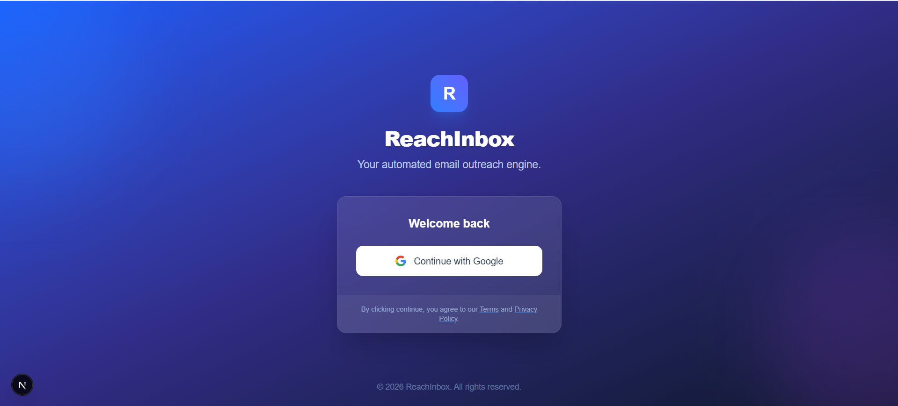

# 🚀 ReachInbox Hiring Assignment - Full-stack Email Scheduler

### 🎥 [Click Here to Watch the Demo Video](https://drive.google.com/file/d/1_vxSCIWObxlm736aYsrZa7a3-KrDEHZh/view?usp=sharing)

[](https://drive.google.com/file/d/1_vxSCIWObxlm736aYsrZa7a3-KrDEHZh/view?usp=sharing)

A production-grade distributed email scheduler built with **Express, BullMQ, Redis, and Next.js**.

## 🚀 Unique Features (Bonus)
Unlike standard submissions, this project includes a highly interactive **Glassmorphism UI**:
* **✨ Interactive Dashboard:** Custom mesh-gradient background with frosted glass cards.
* **🎉 Smart Feedback:** Confetti explosions and Toast notifications upon successful scheduling.
* **⏳ Real-time Updates:** Live countdown timers for scheduled jobs (no page refresh needed).
* **🌙 Dark Mode Login:** A premium, modern authentication screen with animated micro-interactions.

## 🎯 Features Implemented

### Backend (`apps/api`)
- **Architecture:** Express.js + TypeScript monorepo structure.
- **Queue System:** BullMQ (backed by Redis) for persistent, reliable job scheduling.
- **Database:** PostgreSQL (via Prisma) stores Users, Email logs, and Job metadata.
- **Reliability:**
  - **Graceful Recovery:** Survives server restarts. Jobs missed during downtime are processed immediately upon restart.
  - **Throttling:** Enforces a strict **2-second delay** between individual email sends to mimic real-world provider limits.
  - **Rate Limiting:** Sliding window limiter (Redis-backed) checks `sent:{userId}:{hour}`. If the limit is hit, jobs are automatically rescheduled to the next hour.
- **Email Engine:** Ethereal Email (fake SMTP) for safe testing.
- **Auth:** Real Google OAuth implementation (verify ID tokens on backend).

### Frontend (`apps/web`)
- **Dashboard:** Real-time view of scheduled emails with status tracking (Pending, Sent, Failed, Delayed).
- **Campaign Composer:**
  - **CSV Upload:** Parses recipient lists client-side.
  - **Configuration:** Set start time, hourly limits, and content.
- **Auth:** Google Login integration (`@react-oauth/google`).

---

## 🛠️ How to Run Locally

### 1. Prerequisites
- Docker Desktop (must be running for Redis/Postgres)
- Node.js (v18+)

### 2. Start Infrastructure
Spin up the Redis and Postgres containers:
```bash
docker-compose up -d
```

### 3. Setup Backend
```bash
cd apps/api
# 1. Install dependencies
npm install

# 2. Setup Environment Variables
# (Create a .env file based on .env.example with your Google Client ID)
cp .env.example .env

# 3. Initialize Database
npx prisma db push

# 4. Run Server
npm run dev
# Server will start on http://localhost:5000
```

### 4. Setup Frontend
```bash
cd apps/web
# 1. Install dependencies
npm install

# 2. Setup Environment Variables
cp .env.example .env

# 3. Run Client
npm run dev
# Client will start on http://localhost:3000
```

## 🧪 Verification Steps (For Video)

1. **Persistence Test**: Schedule an email, stop the server, wait for the schedule time, restart server. Watch it send immediately.
2. **Rate Limit Test**: Set a low hourly limit (e.g., 2), schedule 5 emails. Observe 2 sending and 3 rescheduling in the backend logs.
